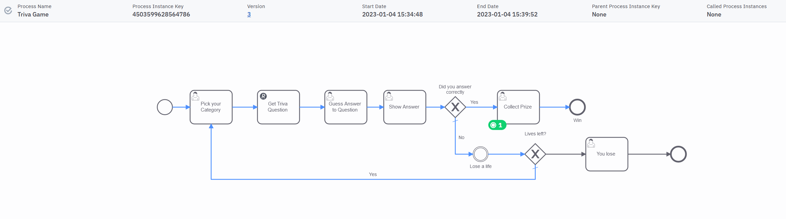

# Trivia Game
This is a simple trivia quiz game designed in BPMN and executable with Camunda 8 Saas.


## The BPMN Process



The process shows that a contestant picks from a list of categories and is then asked to answer a trivia question on that category. If they get it right they collect a prize. If wrong they have 2 more chances and after that they lose the game.

## The Execution

This process uses [Camunda forms](https://docs.camunda.io/docs/guides/utilizing-forms/) rendered in tasklist as a front end for the player and uses a [Camunda Rest Connector](https://docs.camunda.io/docs/components/connectors/out-of-the-box-connectors/rest/) to call a service that returns a trivia question along with the answer.

### How FEEL is used

FEEL is used to do some nice stuff in this example. Firstly it's used to easily parse the results of the rest call and create local variable for the. 

The important part of the response looks like this: 
```JSON
	
"body": [{
    {"category":"geography",
    "question":"Name the desrt located in south-east california. ",
    "answer":"Mojave"}
]}

```
to create the variables we need to show the the question and compare the answer we just need use the following FEEL expression

```javascript
{
  question: response.body.question[1],
  answer: response.body.answer[1]
}
```

FEEL is also used to decrement the lives of player after getting a question wrong. This is done by simply adding a non-intermediate event and added an output expression like this:

```javascript
lives - 1
```

## How to deploy and run

The easiest way to run this is to [create a free account](https://accounts.cloud.camunda.io/signup?uc=signup) for  Camunda 8 SaaS and [upload the BPMN model and forms to a folder](https://docs.camunda.io/docs/components/modeler/web-modeler/import-diagram/) in the web modeler and then [deploy them to a cluster](https://docs.camunda.io/docs/guides/model-your-first-process/)

You also need to get an API Key for the trivia service by creating an [API Ninjas account](https://api-ninjas.com). Once you do [create a secrete](https://docs.camunda.io/docs/components/connectors/use-connectors/#using-secrets) with the key called `ApiNinja`


Then you can start an instance from the modeler and follow complete the tasks in tasklist.